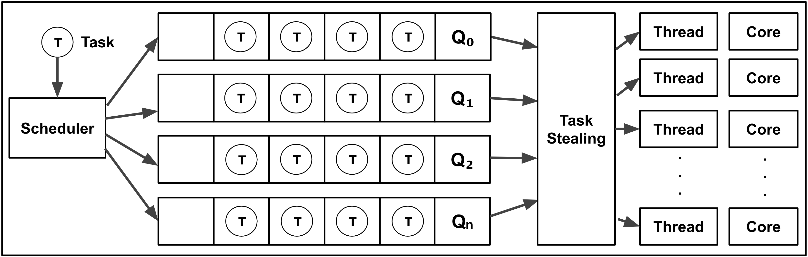

# task_system

`task_system` provides a task scheduler for modern C++.

* The scheduler manages an array of concurrent queues
* A task, when scheduled, is enqueued onto one of queues
* A pool of threads executes ready tasks, potentially stealing tasks for each other's queues

    

### Reference

* **Video**: https://www.youtube.com/watch?v=zULU6Hhp42w
* **Presentation**: https://sean-parent.stlab.cc/presentations/2016-08-08-concurrency/2016-08-08-concurrency.pdf
* **Abstract**: Despite all of the recent interest, concurrency in standard C++ is still barely in its infancy. This talk uses the primitives supplied by C++14 to build a simple, reference, implementation of a task system. The goal is to learn to write software that doesn’t wait.
